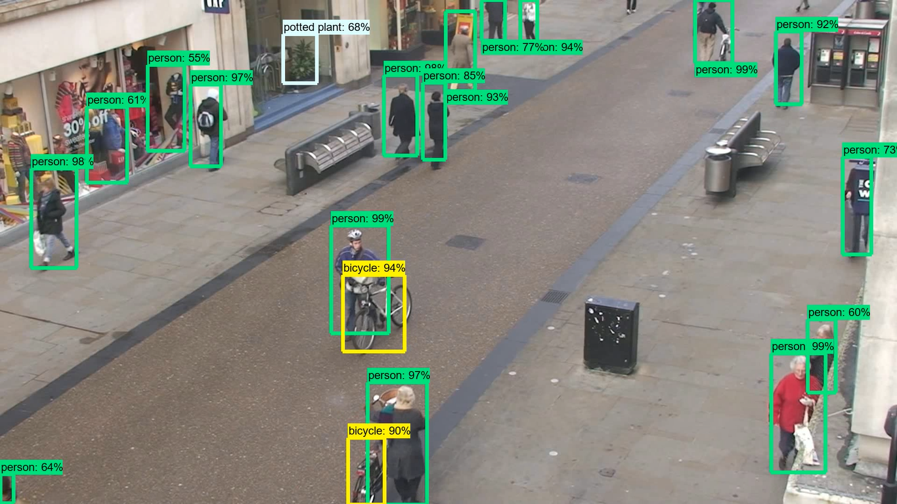
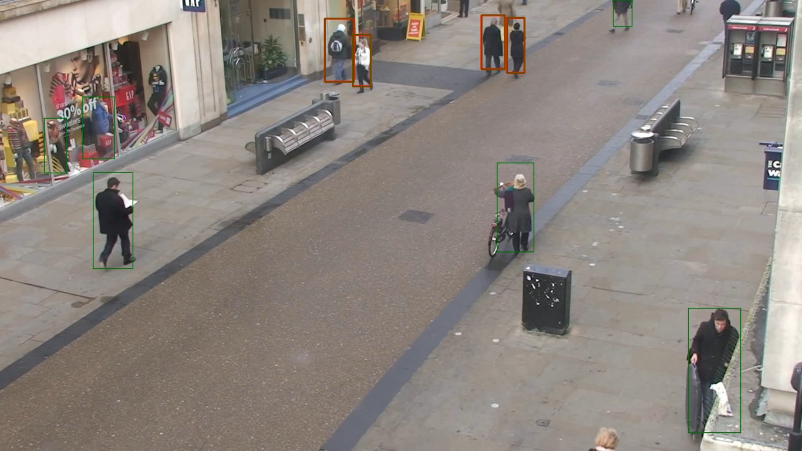

# Social-Distancing
Object Detection , Human Detection using Tensorflow Object Detection API

STEPS : 
1. Object Detection using TensorFlow Object Detection API
2. Convert Video To Images
3. Visualize Objects in Image
4. Delete Boxes of other Objects except for Human
5. Visualize Humans
6. Calculate distance between Human Objects using Euler's distance formula between center points of both objects
7. Change color of human objects which are breaking rules of social distancing.
8. Visualize The Output Image
9. Convert Images to Video

Input Dataset : https://www.robots.ox.ac.uk/ActiveVision/Research/Projects/2009bbenfold_headpose/Datasets/TownCentreXVID.avi

Outputs :

<h3>Object Detection</h3>

<h3>Social Distancing</h3>

Functions

1. load_model
2. run_inference_for_single_image
3. VideoToFrames
4. VisualizeImage
5. DisplayImage
6. FramesToVideo
7. getSingleHumanCoordinates
8. getDistance
9. VisualizeSocialDistancing
10. VisualizeHumanImage
11. FramesToStore
12. SocialDistanceToVideo

**Functions Explaination**:

1. **load_model**   

    Args  : 
            model_name : Passing Tensorflow model Name 
    Returns :  
            Trained model 

2. **run_inference_for_single_image**  

    Args : 
          model : Passing loaded Model 
          image : Image to be processed 
    
    Returns :  
              Output Dictionary which contains 
              1. Detected Boxes Dimensions 
              2. Detected Classes index  
                 eg [1,2,3] 1 is for Person 
              3. Detected Scores which is  
                 list of scores for each detection 
              4. Number of Detected Objects 

3.  **VideoToFrames**  

    Args :  
          VideoFileName : Pass name of video file with ext  
          Path : Pass Path where to store Frames 
    
    Returns: 
            Creates Frames From video and store it in path 

4.  **VisualizeImage** 
    
    Args:  
          ImageName : Pass name of Image to be Visualized 
          Path : path to the image 
          
    Returns: 
            Image with object detected boxes drawn on it 

5. **DisplayImage** 

    Args: 
          Image : numpy array Image 
          
    Output: 
            Prints image to output 

6. **FramesToVideo** 

    Args : 
          no_of_frames : Number of frames to be converted to 
                         Video 
                         
    Output : 
            The Video with 15 fps created using 0-n frames 

7. **getSingleHumanCoordinates** 

    Args : 
          Boxes : List of Detected boxes coordinates 
          Image : Image  
          position: position of object from list of  
                    coordinates 
                    
    Returns :  
            Left right bottom top coordinates of object 

8. **getDistance** 

    Args : 
          x1,x2,y1,y2 : Coordinates to find Distance 
          
    Returns : 
          Distance between (x1,y1) and (x2,y2) 

9. **VisualizeSocialDistancing** 

    Args : 
          Boxes : List of Coordinates of all objects 
          Image : Image To Visualize 
          
    Output : 
          Draws red color on boxes near to each other 

10. **VisualizeHumanImage** 

    Args : 
          ImageName : Name of Image File to Visualize 
          Path : path to Image 
          
    Returns : 
          Image with Boxes drawen 

11. **FramesToStore** 

    Args :  
          tillFrame : Pass number of Frames to Visualize 
          
    Output : 
            Stores Visualized Image To SocialDistancingFrames 
            Folder 

12. **SocialDistanceToVideo** 

    Args : 
          no_of_frames : Pass number of Frames 
          
    Outputs : 
            Video till no_of_frames of 15fps 
